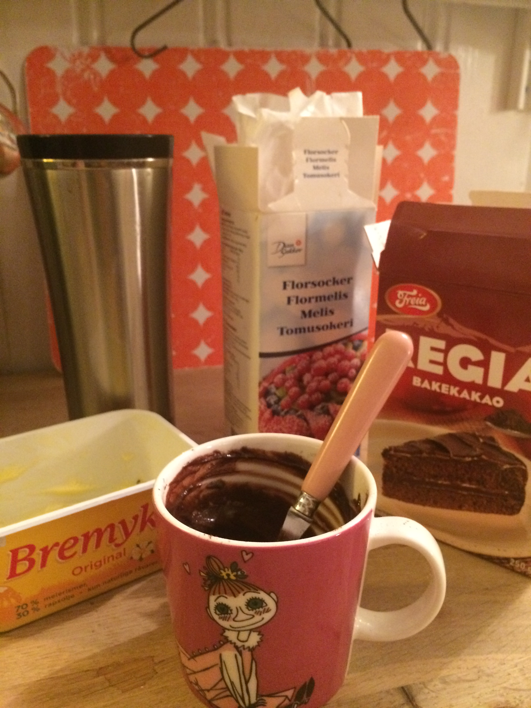

Godtesugen? Men huset er tomt for godteri? Lag glasur!

Er du som meg har noe du nesten alltids litt kakao og melis liggende bakerst i skapet. Ikke bry deg så mye om best før datoen.

<ul>
	<li>Bland en del mer melis enn kakao med litt lunket smør og en skvett sterk kaffe.</li>
	<li>Spis med skje rett fra koppen/skålen/bollen.</li>
</ul>
Dette har vært redningen for meg mange mange flere ganger enn jeg egentlig ønsker å innrømme.

Husker spesielt godt en kveld som student i Trondheim med Eksperter i team rapport-innspurt. Vi hadde av en eller annen merkelig grunn ikke Internett. Men hvis jeg lå på gulvet i et hjørnet av gangen kunne jeg snylte på naboen i etasjen under. Så der lå jeg med laptopen, en bolle med glasur og satte sammen rapport for harde livet.

