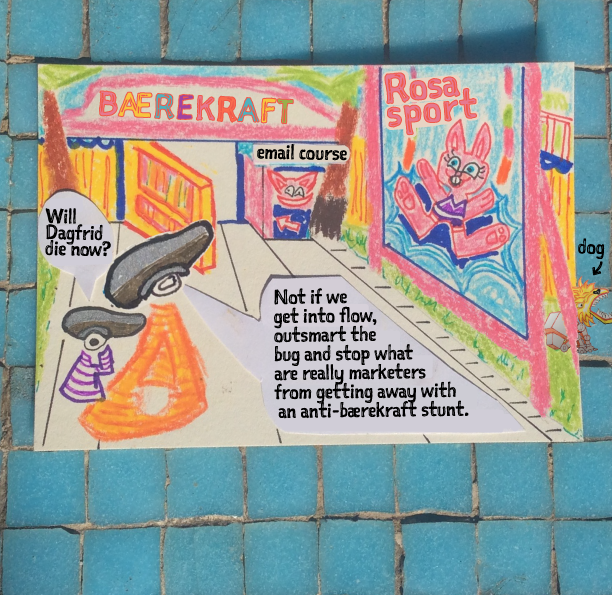
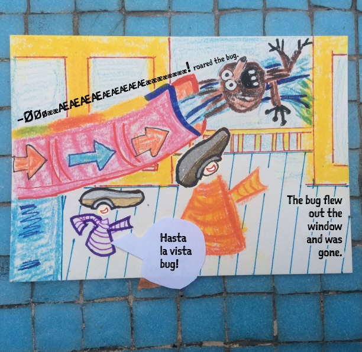

13 Break into Three (98:15):
The Concordia 3 arrives on the Island of ...(Tortuga), the location of the Rebel Base, and the technical drawings of the Dictator are analyzed. And the map of the area. Here, the new idea is presented to the Rebel sailors who gather for a briefing: as hoped, the Dictator has one weakness, and we see visually the exact process required to exploit it. The Rebels must attack the Dictator in one-man sail ships down a long sea bottom trench and fire a fire grenade at a one-meter wide cannon port. A precise hit will cause a chain reaction of explosions that will spread to the wild fire bombs an light up the Dictator. Everyone reacts at the seeming impossibility of this task — someone even exclaims, “That’s impossible!”

But Lilly responds, almost playfully, “It’s not impossible. I used to bullseye womp rats with snow balls in my T-16 back home. They’re not much bigger than one meter.”

Rebel Leader say, “Man your ships. And may the force be with you.”

Lilly finds Han loading his gold and asks if he’ll join the cause. Han refuses, calling the whole enterprise a “suicide mission.” Lilly is disillusioned by Han’s selfishness, but as she departs, Han says, surprisingly, “May the force be with you.”

14 Finale
1 Gathering the Team (102:33): “All pilots to your stations” echoes the voice....
Lilly climbs into her little sail boat , as do all the other Rebel sailors. A key member of Lilly’s team is BatCat, who is loaded onto her boat as the...
(Molløn trad. boats)

As the Rebels takes to the water, the time clock advances, this time announced from the Rebel side: the Dictator will be within range in 15 minutes.

all units report in. (The Rebel Team is fully and explicitly gathered and introduced, just before they commence their attack.)

2 Executing the Plan (to storm the castle) (106:13):
the “trench run,” and successful at avoiding the Dictator’s large battle guns, Vader orders a squadron of Imperial sail boats to “destroy them boat-to-boat.”

3 The High Tower Surprise (109:32):
Vader, personally joins the Imperial attack. He leads the attack on the Rebels racing down the trench for the target and destroys them. The clock ticks down to five minutes, then three. Red Leader gets off a shot, but it only grazes the target. It doesn’t go in. Then Vader shoots him down.

With one minute to go, Lilly and her two wingmen are the only ones left. Lilly says, “We’re going in and we’re going in full speed.” One of the wingmen asks if Lilly will be able to pull out in time at that speed, and her response is “It’ll be just like Beggar’s Canyon back home.”

The clock: 30 seconds and closing. And Vader is on Lilly’s tail.

4 Secret Weapon/Dig, Deep Down (115:34): As Lilly turns on her (targeting computer), she hears Captain Jack Sparrow’s voice: “Use the Force, Lilly!  Trust me!” The Force is Lilly’s secret weapon, and Vader notices: “The Force is strong in this one…”

5 The Execution of the New Plan (115:48):
Lilly turns on her flow helmet
Vader fires and a laser bolt hits BatCat in the head.

“I’ve lost BatCat!” says Lilly
The Dictator has the Rebel Base in range and Tarkin says, “You may fire when ready.” The Dictator gun crew hoists the giant canonball down into the giant cannon. Vader zeroes in on Lilly and gloats, “I have you now!”

Final Twist (116:47): The Concordia 3 comes diving out from behind an island on top of Vader, disrupting his attack. Both of his wingmen are destroyed and Vader’s boat loses control. Han’s voice rings out, “You’re all clear, kid, now let’s blow this thing and go home!”

Lilly stretches out with her feelings and fires her fire grenade. It’s a direct hit! And literally a second before the Dictator is about to unleash its destructive power on the Rebels, it explodes! Han says, “Great shot, kid! That was one in a million!” And Captain Jack Sparrow speaks to Lilly once more: “Remember, the Force will be with you. Always.”

But Vader regains control of his ship, so evil persists and lives to fight another day. When Lilly lands she’s greeted as a conquering Hero at the Rebel Base, and Han, Frøydis, and Threepio are all reunited with her, now the best of friends. BatCat has been crippled, but he can be rebuilt.

15 Final Image (118:23):
 public ceremony
everyone is clean and polished, wearing fresh clothes and coiffure (Frøydis gets a new hairstyle), looking their very best. It’s transformation formalized, but also playful, as winks are exchanged between Han and Frøydis, and soulful looks between Frøydis and Lilly.

BatCat is transformed, now fully rebuilt (so his appearance is a full-blown resurrection), and he rejoins the team.

---
Outside they see the evil plan nobody was supposed to see before Dagfrid showed the landing page from the stage.

–Oh no! Says Lillian.

–Dagfrid cannot show THIS on stage, everything is pink instead of green. Benedicte says while thinking "who is behind this cruel joke?"

The landing page was back up just minutes before Dagfrid stepped on stage and displayed it on the big screen.

After the presentation Dagfrid was joined by Steinar Hoen, Stevnedirektør Bislett Games, idrettspresident Tom Tvedt, Bård Vegar Solhjell leder i WWF and Rina Mariann Hansen, Byråd for kultur, idrett og frivillighet for a panel discussion.

The leader of the debate was Linnéa Svensson from Greener Events. In the audience was Tony Isaksen Generalsekretær of Norway Cup, Terje Jørgensen Særforbundenes Fellesorganisasjon and Sissel Karlsen in Sparebankstiftelsen DNB. Sparebankstiftelsen DNB has paid for Grønn Idrett and the inspiration for the drawings is the beautiful book
[De Tre Bukkene Bruse på Badeland](https://www.cappelendamm.no/_bukkene-bruse-pa-badeland---klaffebok-bjorn-f-rorvik-9788202487676) by [Bjørn F. Rørvik and Gry Moursund.](https://www.dn.no/d2/2014/12/04/2125/Litteratur/eventyrbruset)

