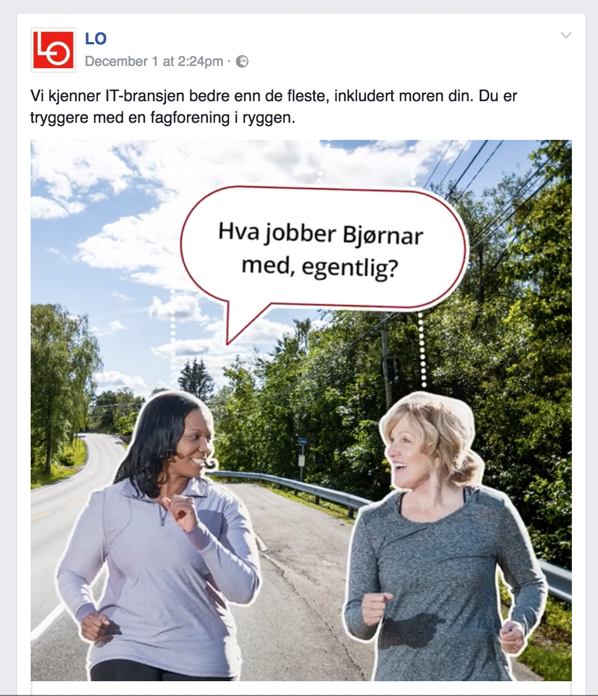
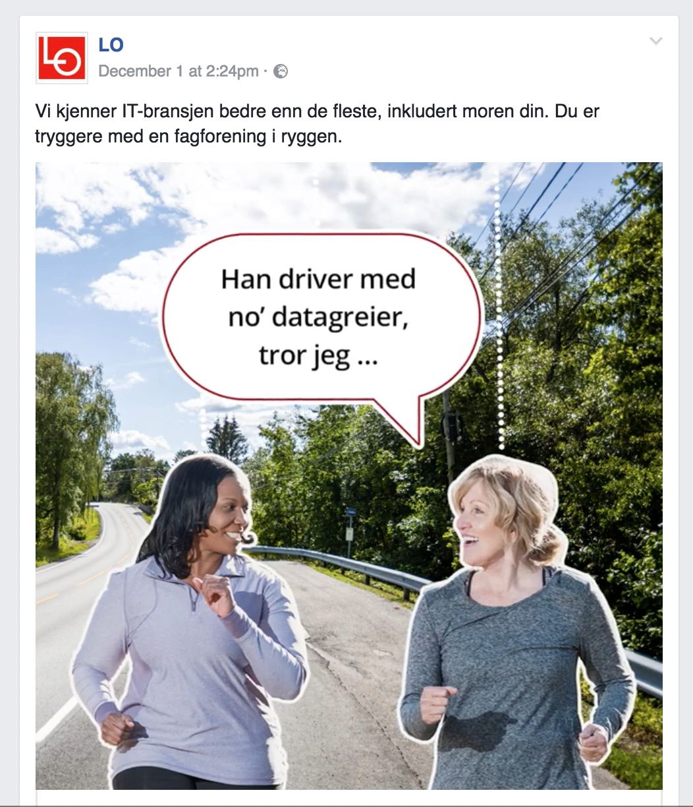
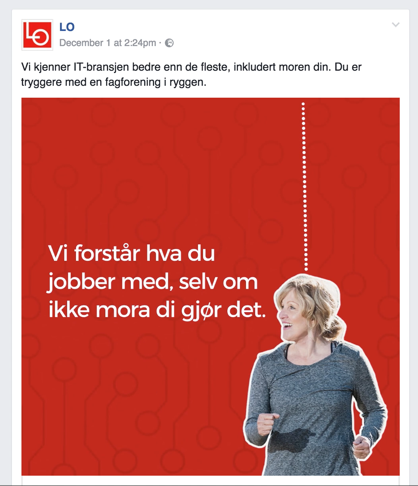

PS. Denne ranten ble skrevet i starten av desember 2016.

--

It is NOT an ordinary Monday morning for the NOT–a–morning–person and full stack developer (Siv.Ing) Benedicte.

Only good thing is that she is still in bed. The bad things: a bad cough, bad headache, fever, no coffee and daughter not yet delivered in kindergarten.

"Why no coffee in bed?" You might ask. Because Benedicte’s partner in crime, Ola, is at a «better bærekraft in sports» breakfast release party at Bislett Stadion.

He has built a lightweight landing page for Grønn Idrett. In an hour Ex-Secretary General of the Norwegian Snowboard Federation, Dagfrid Forberg, will go on stage and present the landing page to promote the «Best Bærekraft in Norwegian Sports 2018» competition.

But the landing page is not working!

Benedicte luckily checks her phone and springs into action.

–Lillian! Let’s go hunt some bugs! Benedicte shouts to Lillian (3).
–Jippi! is the answer.
–Go get our virtual reality helmets!
–Yesss!

Seconds later inside the virtual reality of the landing page.

Benedicte fixes the bug and the landing page is working again.

–Nice work mum!
–That was almost too easy...
–Look! What a weird dog.
–Where?!
–It ran outside. Lillian points to the open door.
–Let's go!

Outside they see the evil plan nobody was supposed to see before Dagfrid showed the landing page from the stage.

–Oh no! Says Lillian.
–Dagfrid cannot show THIS on stage, everything is pink instead of green. Benedicte says while thinking "who is behind this cruel joke?"

The landing page was back up just minutes before Dagfrid stepped on stage and displayed it on the big screen.

After the presentation Dagfrid was joined by Steinar Hoen, Stevnedirektør Bislett Games, idrettspresident Tom Tvedt, Bård Vegar Solhjell leder i WWF and Rina Mariann Hansen, Byråd for kultur, idrett og frivillighet for a panel discussion.

The leader of the debate was Linnéa Svensson from Greener Events. In the audience was Tony Isaksen Generalsekretær of Norway Cup, Terje Jørgensen Særforbundenes Fellesorganisasjon and Sissel Karlsen in Sparebankstiftelsen DNB. Sparebankstiftelsen DNB has paid for Grønn Idrett and the inspiration for the drawings is the beautiful book "De Tre Bukkene Bruse på Badeland" by Bjørn F. Rørvik and Gry Moursund.
Meld deg på e-post kurset Grønn Idrett
"Steinar, hva gjør du for å spre bærekraft i norsk idrett?"
Spør Linnéa i videoen under. Steinar svarer:

"Vi går foran med et bærekraftig eksempel, Bislett Games."

Lanseringen av Grønn Idrett var:
E-postkurs
Konkurranse
Miljøhåndbok

Klikk på bildet for å se videosnutten av Steinar Hoen, 4 minutter og 32 sekunder.

To Steinar Hoen sitater fra videoen over
–Slik Ola hørte dem:

"Vårt samfunnsansvar ovenfor idrettsnorge er å lage et idrettsarrangement på Bislett som er et positivt eksempel på bærekraft."
  –Steinar Hoen, stevnedirektør Bislett Games.

"Jeg skal like å se den sponsorsjefen som tør å ta den risikoen å sponse et arrangement som får overskrift i avisen "Forsøpler naturen!" og stygt bilde."
  –Steinar Hoen, stevnedirektør Bislett Games.

