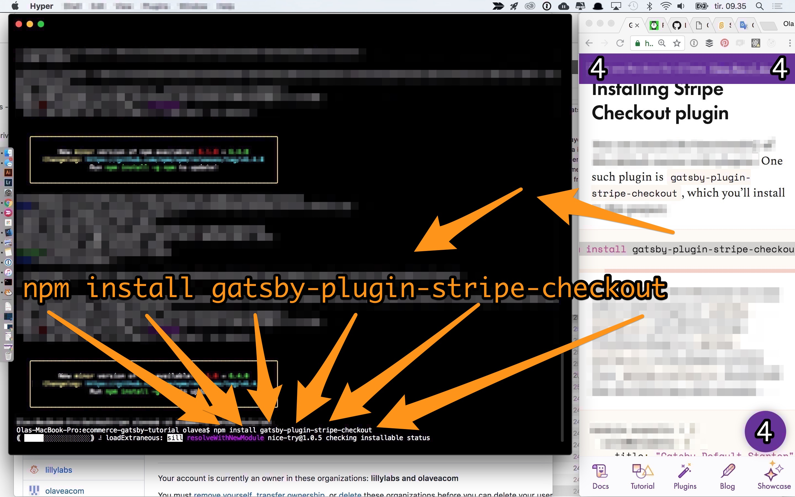

Their ship is caught ... and pulled close to the Dictator!
Lilly says, “I’ve got a bad feeling about this.”
Dvorak: “They won’t take me without a fight,” and UnicornParrot gives out a worried bellow,
A-da: “There are alternatives to fighting,”

As we near the Dictator, we get a sense of its enormous size for the first time.

10 Bad Guys Close In (66:50):
Drake: "Check every part of the ship." He also says, significantly, “I sense something. A presence I’ve not felt since…”

we next see our trio of Heroes walking the corridors in their disguises, they come upon one of these Ratbot. UnicornParrot suddenly roars at it and the poor little Ratbot, apparently scared out of its mind, backs up and scurries away in terror. Once it’s gone, UnicornParrot chortles and shrugs, evidently enjoying the outcome. “effervescent giddiness”

A-da to Drake: “If you strike me down I will become more powerful than you can possibly imagine.”... the duel attracts the attention of the guards posted around the Concordia III, which allows Lilly, Dvorak, Frøydis, and UnicornParrot, in addition to PyramidParrot and CapMorgan, to get to the ship. But before boarding, Luke spots A-da battling with Drake.

11 All Is Lost (92:23):
When A-da spots Lilly about to escape aboard the Concordia 3, he makes a clear decision to put up his sword and shut his eyes.

coup de grace. But wait — before she is struck, A-da dematerializes and her empty robe drops to the floor. Is A-da dead? Lilly thinks so. (Or did A-da time travel?)

“Run, Lilly. Run!” shouts A-da.

On the Concordia 3 as it rockets away from the Dictator, Lilly (even though she heard A-da’s voice in her head) is devastated over the loss, which she still believes is some kind of death. Frøydis comforts her with a blanket over her shoulders.
