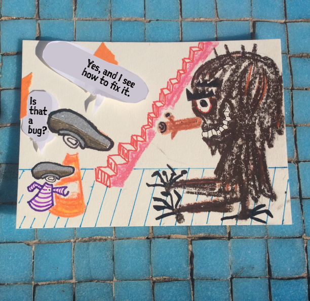

9 Midpoint(63:05):
Their ship is caught ... and pulled close to the Dictator!
Lilly says, “I’ve got a bad feeling about this.”
Han: “They won’t take me without a fight,” and Chewie gives out a worried bellow,
BEn: “There are alternatives to fighting,”

As we near the Death Star, we get a sense of its enormous size for the first time.

10 Bad Guys Close In (66:50):
Vader: "Check every part of the ship." He also says, significantly, “I sense something. A presence I’ve not felt since…”

we next see our trio of Heroes walking the corridors in their disguises, they come upon one of these Mousebots. Chewie suddenly roars at it and the poor little Mousebot, apparently scared out of its mind, backs up and scurries away in terror. Once it’s gone, Chewie chortles and shrugs, evidently enjoying the outcome. “effervescent giddiness”

Ben to Vader: “If you strike me down I will become more powerful than you can possibly imagine.”... the duel attracts the attention of the guards posted around the Concordia III, which allows Lilly, Han, Frøydis, and Chewie, in addition to Threepio and Artoo, to get to the ship. But before boarding, Luke spots Ben battling with Vader.

11 All Is Lost (92:23):
When Ben spots Lilly about to escape aboard the Concordia 3, he makes a clear decision to put up his sword and shut his eyes.

coup de grace. But wait — before he is struck, Ben dematerializes and his empty robe drops to the floor. Is Ben dead? Lilly thinks so. (Or did Ben time travel?)

“Run, Lilly. Run!” Ben

12 Dark Night of the Soul (93:45):
On the Concordia 3 as it rockets away from the Dictator, Lilly (even though she heard Ben’s voice in her head) is devastated over the loss, which she still believes is some kind of death. Frøydis comforts her with a blanket over her shoulders.

-----
Seconds later inside the virtual reality of the landing page.

Benedicte fixes the bug and the landing page is working again.

–Nice work mum!

–That was almost too easy...

–Look! What a weird dog.

–Where?!

–It ran outside. Lillian points to the open door.

–Let's go!