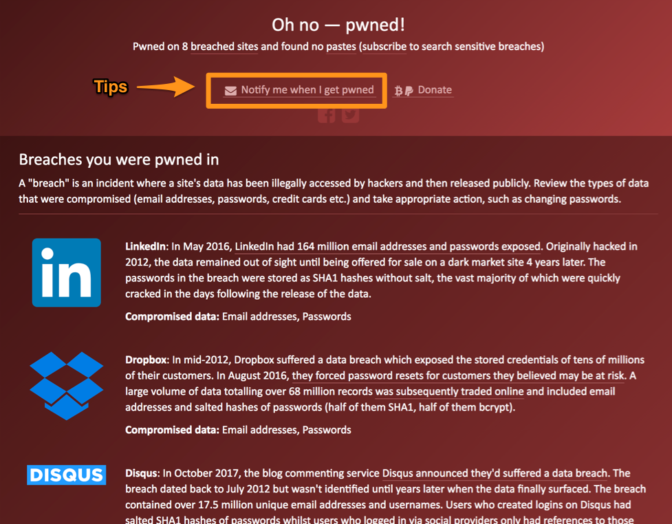

Passord er noe hærk!

Ønsker du kun løsning? Klikk deg videre til [1Password](https://1password.com/) og følg deres instruksjoner. Gjør du det vil du automatisk få gode passordrutiner.

# Gode passord rutiner

1.  Velg sterke passord.
2.  Bruk unike passord.
3.  Er det ekstra viktig, skru på to-faktor autentisering.

Punktene over resulterer i at du burde bruke et passord-håndteringsprogram som [1Password](https://1password.com/) eller en notatbok alla [My password journal](http://amzn.to/2DZSDEX).

## 1. Sterke passord

Lange relativt enkle passord "brimful-praise-buckaroo-dave", er bedre enn korte komplekse passord "L3t!tg0" ("Let it go" med erstatninger for e, i og o).

"Men vent nå litt. På jobben er det maks 12 tegn og det må være minst 1 tall og et spesialtegn" tenker du kansje. Dem om det! Ekspertene er uenig og tegneseriestripen fra xkcd forklarer hvorfor.

## 2. Unike passord

Ikke bruk samme passord flere steder.

Når en av tjeneste du bruker blir "eid", og innloggingsdetaljene dine ligger til salgs på the dark web, er det fint å vite at kjøperen ikke kan komme seg videre inn i andre tjenester du bruker.

Innloggingsdetaljer lekkes oftere enn man skulle tro. Ved jevne mellomrom dukker det opp "jeg er blitt hacket" oppdateringer på Facebook. Lekking av innloggingsdetaljer fra en annen tjeneste er nok ofte grunnen.

Sjekk om din bruker har vært del i en, eller flere, av de store internasjonale skandalene på [Have I've been pawned](https://haveibeenpwned.com/).

Det kan også være en gode idé å si ja takk til "Notify me when I get pawned". Tjenesten leveres av den anerkjente sikkerhetseksperten Troy Hunt.

## 3. To faktor autentisering.

To faktor autentisering (2FA) kommer i flere varianter. Det kan være komplekse løsninger som BankId; noe så enkelt som en sms med en kode eller et ark du har fått tilsendt i posten med koder.

Det skal et mye mer sofistikert, og rettet angrep, for at noen får tak i passordet ditt OG mobilen din (eller arket du har hjemme i skuffen) enn kun passordet.

To faktor autentisering kan være litt irriterende. Men er absolutt verdt å skru på for viktige tjenester.

Et sted du burde skru på to faktor autentisering, nå med en gang, er e-post kontoen din. Utestenging fra egen e-post konto vil medføre masse kjipt arbeid. I tillegg vil en person med tilgang til e-post kontoen din raskt få kontroll over dine kontoer hos andre tjenester.

* [Sku på 2FA hos Gmail](https://support.google.com/accounts/answer/185839)
* [Skru på 2FA hos Outlook.com/Hotmail](https://support.microsoft.com/en-in/help/12408/microsoft-account-about-two-step-verification)

## 4. Passord-håndteringsprogram

I realiteten betyr alt dette at du burde skaffe deg et passord-håndteringsprogram. Jeg anbefaler [1Password](https://1password.com/).

Mange spør meg "Men er 1Password sikkert da?". Ingenting på internett er 100% sikkert, men 1Passwords leverbrød er sikkerhet. Derfor er de sikrere enn de fleste tjenestene du har konto hos. I tillegg er det så uendelig mye bedre enn at du prøver å huske et stort antall unike og gode passord oppi hodet ditt.

Som sikkerhetsekspert Troy Hunt skriver på sin blogg: [Password managers don't have to be perfect, they just have to be better than not having one](https://www.troyhunt.com/password-managers-dont-have-to-be-perfect-they-just-have-to-be-better-than-not-having-one/).

Der slår han også et slag for den analoge versjonen, en notatblokk med nedskrevne passord. Ikke så dumt som du kanskje ville trodd.
